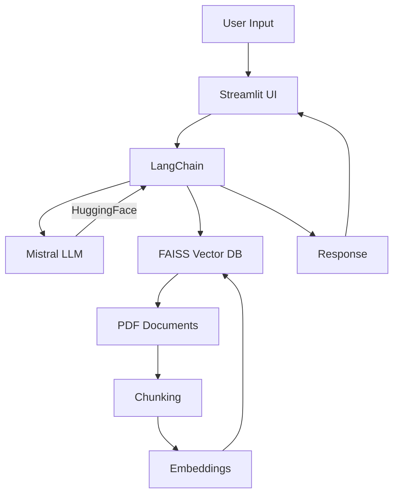

# MediBot - AI Medical Chatbot using RAG

A modern AI chatbot for medical documents using Retrieval Augmented Generation (RAG) technology.

## Project Overview

MediBot is a modular 3-phase chatbot project that allows users to query medical documents through a conversational interface. The system leverages state-of-the-art language models and vector database technology to provide accurate, context-aware responses.

## Project Layout

### Phase 1 – Setup Memory for LLM (Vector Database)
- Load raw PDF(s)
- Create document chunks
- Generate vector embeddings
- Store embeddings in FAISS vector database

### Phase 2 – Connect Memory with LLM
- Setup LLM (Mistral via HuggingFace)
- Connect LLM with FAISS vector store
- Create processing chain

### Phase 3 – Setup UI for the Chatbot
- Develop chatbot interface with Streamlit
- Load vector store (FAISS) in cache
- Implement Retrieval Augmented Generation (RAG) pipeline

## Tools & Technologies

- **Langchain** - AI Framework for LLM applications
- **HuggingFace** - ML/AI Hub for models and datasets
- **Mistral** - Large Language Model
- **FAISS** - Vector Database for efficient similarity search
- **Streamlit** - For building the chatbot UI
- **Python** - Primary programming language
- **VS Code** - Integrated Development Environment

## Technical Architecture

## Future Improvements

- Add user authentication to the UI
- Implement self-upload document functionality
- Support multiple documents and combined embeddings
- Add unit testing for RAG applications
- Expand to other document types beyond medical

## Summary

MediBot represents a modern approach to document interaction:
- Modular 3-phase implementation
- Utilizes cutting-edge technologies:
  - Streamlit | Langchain | HuggingFace
  - Retrieval Augmented Generation (RAG)
  - Vector Embeddings
  - End-to-end RAG pipeline

## Getting Started

[Add your installation and usage instructions here]

## Contributing

Feedback and contributions are welcome! Please see the [contribution guidelines](CONTRIBUTING.md).

## License

[Specify your license here]
